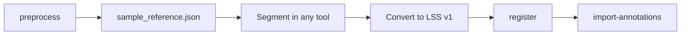

# Annotation import (LightSuite Sample Space v1)

Import cell coordinates or segmentation masks from **any** external tool into atlas space. All tools must export into a single native sample-space convention before running `import-annotations`.

---

## Workflow overview



1. **`lightsuite brain preprocess`** — writes `regopts.json` and **`sample_reference.json`** (native grid contract).
2. **Segment** at **native resolution** on the same grid as the stitched sample (not the 20 µm registration preview TIFF).
3. **Convert** tool output to `points.csv` or `mask.tif` (see below). Vendor-specific formats (Arivis, LCT, etc.) need a one-time local converter.
4. **`lightsuite brain register`** — produces `transform_params.json`.
5. **`lightsuite brain import-annotations`** — warps annotations into atlas space.

The **spinal cord** pipeline uses the same native `points.csv` / `mask.tif` contract. After
`lightsuite spinal register`, run `lightsuite spinal import-annotations`. Cord preprocess
writes `sample_reference.json`; convert Imaris spot CSVs with
`lightsuite spinal convert-imaris-spots` (see [Spinal cord usage](usage_spinal_cord.md)).

---

## Native sample-space reference

After preprocess, read `<save_path>/sample_reference.json`:

```json
{
  "format": "lightsuite_sample_space_v1",
  "sample_name": "Gilda",
  "shape_yxz": [5834, 5690, 2052],
  "voxel_um": [2.03, 2.03, 3.0],
  "index_base": 1,
  "axis_order": "xyz",
  "coordinate_units": "voxel_indices",
  "orientation_applied": false
}
```

| Field | Meaning |
|-------|---------|
| `shape_yxz` | Volume shape **(Y, X, Z)** = **(ny, nx, nz)** at native resolution |
| `voxel_um` | Voxel size **[x, y, z]** in µm (same as `sample.voxel_um` in YAML) |
| `index_base` | Always **1** — first voxel center is at `(1, 1, 1)` |
| `axis_order` | Always **`xyz`** for point coordinates |
| `orientation_applied` | Always **false** — do not apply `registration.orientation` yourself; LightSuite applies it during the warp |

**Do not** segment on `chan_*_sample_register_20um.tif` unless you rescale coordinates back to native indices first. The reference grid is the **full-resolution** stitched stack described in `regopts.json`.

---

## Point coordinates — `points.csv`

CSV with a header row. Required columns: **`x`**, **`y`**, **`z`** (case-insensitive).

```csv
x,y,z
1863.0,102.0,2.0
1864.5,103.2,2.0
```

- **Units:** 1-based voxel indices at native resolution (floats allowed for center-of-mass).
- **Bounds:** `1 ≤ x ≤ nx`, `1 ≤ y ≤ ny`, `1 ≤ z ≤ nz` (from `shape_yxz`).
- **Extra columns** (e.g. `intensity`, `volume_um3`) — numeric values are preserved as optional features; text columns (e.g. segment names) are skipped.

Example file: `examples/annotation_sample/points.csv`.

---

## Segmentation mask — `mask.tif`

3D binary TIFF at **native resolution**:

- **Shape:** `(Y, X, Z)` = `shape_yxz` from `sample_reference.json`
- **Values:** `0` / `255` or `0` / `1`
- **Layout:** Z-stack of 2D pages (one page per Z slice) or a single 3D TIFF page
- **Voxel size:** must match `voxel_um` in `sample_reference.json` (no resampling at import)

Example: segment on a native-resolution export of the structural channel, save as `mask.tif`.

---

## YAML configuration

```yaml
import:
  write_csv: true
  converter:
    suite: smartspim   # native | smartspim | fiji | imaris | arivis | custom
    source: /data/Jules/cell_detection/488_points_Endogenous.json
    output: /data/Jules/converted/smartspim_488_points.csv   # optional
    label: smartspim_488
    # custom_entry: /path/to/my_converter.py   # required when suite: custom
    # voxel_um: [1.0, 1.0, 1.0]                # Imaris / FIJI calibration
  annotations:
    - format: points_csv
      path: /data/Jules/converted/smartspim_488_points.csv
      label: smartspim_488
```

Run convert (after preprocess) then warp (after register):

```bash
uv run lightsuite brain convert-annotations -c my_mouse.yaml
uv run lightsuite brain import-annotations -c my_mouse.yaml
```

| Key | Description |
|-----|-------------|
| `converter.suite` | Vendor prepare step; `native` only validates existing `annotations` |
| `converter.source` | Vendor export path |
| `converter.custom_entry` | Required for `custom` — Python module with `convert_to_lightsuite` |
| `format` | `points_csv` or `mask_tiff` (post-conversion Sample Space) |
| `path` | Path to the CSV or TIFF file |
| `label` | Output filename stem (defaults to file stem) |

---

## Outputs

Written to `<save_path>/volume_registered/`:

| Kind | Files |
|------|-------|
| Points | `{label}_atlas_coords.npz`, `{label}_sample_coords.npz`, optional `{label}_atlas_coords.csv` |
| Mask | `{label}_registered_atlas.tif`, `{label}_in_sample_20um.tif` |
| Summary | `import_annotations_summary.json` |

For spinal cord samples, run `lightsuite spinal region-stats` to bin imported points
into Fiederling regions and rostrocaudal segments (`region_stats.csv`).

NPZ arrays:

- `atlasptcoords` — atlas-space coordinates
- `regptcoords` — registration-grid coordinates (in `{label}_sample_coords.npz`)
- `sampleptcoords` — native sample-space coordinates (input)

---

## Converting from external tools

Each site maintains a small converter script. Common translations:

| Source | Conversion |
|--------|------------|
| **0-based indices** | Add 1 to each coordinate |
| **`[z, y, x]` order** | Reorder to `[x, y, z]` |
| **Arivis Blob Finder CSV** | Use COM columns as `x,y,z`; add 1 if 0-based |
| **FIJI point tool `Results.csv`** | Columns `X`, `Y`, `Slice` (or `Z`). When ImageJ spatial calibration is set, XY are in calibrated units (typically µm) — run `lightsuite brain convert-fiji-points --voxel-um <x,y,z>` matching the stack you segmented on. `Slice` is already 1-based; use it directly as `z`. Omit `--voxel-um` only when X/Y are raw pixel coordinates. |
| **Imaris Spot_OnePageMultiComponent_Detailed.csv** | Filter by `Component Name`; use `lightsuite spinal convert-imaris-spots`. Set `--voxel-um` from **Imaris** Image Properties voxel size (not blindly from `sample.voxel_um`). Use `1,1,1` when the `.ims` is 1 µm isotropic on the same grid; use hybrid values (e.g. `1,1,1.8`) when XY matches LightSuite indices but Z plane counts differ — see [Spinal cord usage](usage_spinal_cord.md) |
| **Imaris mask TIFF series** | One label slice per Z (`*_Z####.tif`, 0-based in filename); binarize `(plane > 0)` and stack to multi-page TIFF |
| **SmartSPIM / LCT detection JSON** `[[z,y,x],…]` | Set `import.converter.suite: smartspim` and run `lightsuite brain convert-annotations` (or `convert-smartspim-points`). Do **not** import `*_projected_points.json`. |
| **Custom tool** | Provide a `.py` file with `convert_to_lightsuite(source, output, *, reference) -> dict` (`import.converter.suite: custom`). Convert-annotations **always validates** the written Sample Space file. Example: [`examples/annotation_sample/custom_converter_example.py`](../examples/annotation_sample/custom_converter_example.py). |
| **LCT JSON** `[[z,y,x],…]` (generic) | Reorder to `x,y,z`; add 1 |
| **Downsampled segmentation** | Resample mask/coordinates to native `shape_yxz` before import |

Validate against `sample_reference.json` before import:

- Point count and coordinate ranges
- Mask shape `(ny, nx, nz)` and voxel size

---

## Validation errors

| Error | Fix |
|-------|-----|
| Missing `sample_reference.json` | Run `preprocess` |
| Mask shape mismatch | Resample mask to native `(Y, X, Z)` |
| All points out of bounds | Check axis order and index base (+1 for 0-based tools) |
| Most points outside cord / background after import | Re-check Imaris voxel calibration vs `--voxel-um` (1 µm `.ims` often needs `1,1,1` or hybrid `1,1,1.8`, not microscope `1.8,1.8,1.8`) |
| Missing `transform_params.json` | Run `register` before import |

---

## Multiresolution: segmenting on a higher-resolution ROI

The spec above assumes annotations sit on the same native grid as the registered sample. When segmentation runs on a high-resolution ROI that was registered to a lower-resolution overview, use [`lightsuite multires import-annotations`](usage_multiresolution.md#step-9--optional--import-segmentation-from-the-roi) as a first stage:

```
ROI-native CSV/mask  ──multires import-annotations──▶  overview-native CSV/mask  ──brain import-annotations──▶  atlas
```

The multires stage reads 1-based **ROI** voxel indices and writes 1-based **overview** voxel indices in the exact formats documented here, so the two stages compose without any conversion step. Masks are warped with nearest-neighbour interpolation to preserve labels.

---

## Limitations

- **Native resolution only** — registration-resolution (20 µm) masks/coordinates are not accepted.
- **Allen cell-count parcellation** — atlas coordinates are written; per-region counts require MATLAB or external tooling.

---

## See also

- [Brain lightsheet usage](usage_lightsheet_brain.md) — full pipeline and command cheat sheet
- [Multiresolution registration](usage_multiresolution.md) — ROI → overview segmentation transfer
- `examples/annotation_sample/` — minimal example CSV
