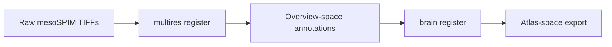

# Combined multiresolution → brain atlas registration

Some mesoSPIM projects acquire a **low-magnification overview** and a **high-magnification ROI**,
register them with `lightsuite multires`, segment on the ROI (or warp ROI segmentation to overview),
then run **brain atlas registration** on the overview-aligned data.

This guide chains the two Python workflows using the Marianna CMU example configs.

---

## Overview



| Step | Config | CLI namespace |
|------|--------|---------------|
| 1. Overview ↔ ROI | `examples/config/multiresolution/marianna_multires.yaml` | `lightsuite multires` |
| 2. Brain atlas | `examples/config/mesoSPIM/marianna_perens.yaml` | `lightsuite brain` |

> **MATLAB parity only:** `examples/config/mesoSPIM/marianna_yosi_parity.yaml` uses pre-warped
> `*_0p8x.*` segmentation files instead of `multires import-annotations` outputs.

---

## Step 1 — Multiresolution registration

Copy and edit paths from the multires template, or build a manifest:

```bash
# Optional: build pair manifest without a notebook
lightsuite multires build-manifest \
  --vendor mesospim \
  --sample-name Marianna \
  --pair-label u87_488_561 \
  --channels-json '{"488":{"overview":"/path/0.8x_488.tif","roi":"/path/2.5x_488.tif"},"561":{"overview":"/path/0.8x_561.tif","roi":"/path/2.5x_561.tif"}}' \
  --reference-channel 488 \
  --lateral-flip-overview -1,-1 \
  --lateral-flip-roi -1,-1 \
  -o /path/to/u87_488_561_pair.json
```

Run the multires pipeline (geometry QC → register → optional import):

```bash
uv sync --extra registration --extra gui

lightsuite multires stages -c my_multires.yaml
lightsuite multires run -c my_multires.yaml --through register
lightsuite multires run -c my_multires.yaml --from import-annotations --resume
```

`import-annotations` warps ROI-native `points_csv` / `mask_tiff` layers onto the **overview grid**
under `save_path/annotations_in_overview/`. Those paths feed the brain config `import.annotations` block.

See [Multiresolution usage](usage_multiresolution.md) for `lateral_flip`, landmarks, and geometry QC.

---

## Step 2 — Brain atlas registration

Create a brain YAML (copy `examples/brain_lightsheet.yaml`) with:

- `sample.source` pointing at the **overview** stitched volume (same grid as multires overview)
- `import.annotations` pointing at `annotations_in_overview/` outputs from step 1
- Optional `multires.config` (or `multires.checkpoint`) on the brain YAML to overlay
  registered ROI intensity on the **20 µm sample grid** in `view-registration`
  (no segmentation required — reads `registered_roi_full_overview_path` from
  `multires_regopts.json`)
- Atlas provider/resolution matching your project (Perens 20 µm in `marianna_yosi_parity.yaml`)

```bash
lightsuite brain stages -c my_brain.yaml
lightsuite brain run -c my_brain.yaml --through match-points   # pause before register if using GUI
lightsuite brain run -c my_brain.yaml --from register --resume
```

Or run stages individually — see [Brain lightsheet usage](usage_lightsheet_brain.md).

---

## Checkpoint files

| Workflow | Checkpoint | Location |
|----------|------------|----------|
| Multires | `multires_regopts.json` | `sample.save_path/` |
| Multires import | `annotations_in_overview/` | `sample.save_path/` |
| Brain | `regopts.json`, `transform_params.json` | `sample.save_path/` |
| Brain export | `volume_registered/` | `sample.save_path/` |

---

## MATLAB interoperability

If step 1 or 2 was started in MATLAB:

1. `export_python_config(savepath)` → YAML
2. `lightsuite brain import-matlab-control-points` for legacy `.mat` control points
3. Compare `registration_diagnostics.json` / overlay PNGs to MATLAB QA plots

See [Python vs MATLAB](python_vs_matlab.md) and [Migrating from MATLAB](usage_lightsheet_brain.md#migrating-from-matlab).
